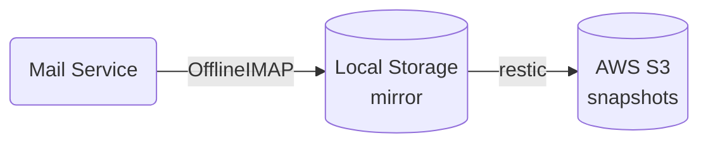

## TL;DR

オンラインのメールサービスを利用していますが、
このバックアップを AWS S3 にとるようにしました。
作業記録と設定内容の忘備録。

## 背景

私はインターネットの初期にはメールは手元の PC にダウンロードして読んでいましたが、
GMail が登場して以来、
オンラインのメールサービスを利用しています。

オンラインのメールサービスは PC やスマートフォンなど環境を問わずにメールを利用できて便利なのですが、
メールのデータはサービス提供者側のサーバーにあるため、
サービス提供者側のデータセンターで深刻な障害が発生したり、
アカウントが停止された場合にはメールを読むことができなくなります。

すぐにアクセスが必要なメールを読めなくなったり、
恒久的にメールを失ってしまうリスクを緩和するために、
メールのバックアップ環境を構築しました。

## システム概要

Linux マシンで日次でメールサーバーにあるメールの変更内容をチェックし、
Amazon が提供するオンラインストレージサービスである AWS S3 にバックアップを取るようにしました。

実際には２段階のステップがあり、
まずメールサービスから [IMAP](https://www.cloudflare.com/ja-jp/learning/email-security/what-is-imap/) を利用してローカルストレージにメールサーバーの状態をコピーし、
次にローカルストレージからオンラインストレージサービスにバックアップを作成します。
それぞれのステップで下記のツールを利用しています。

- [OfflineIMAP](https://www.offlineimap.org/)
- [restic](https://restic.net/)



いずれのツールも差分でのデータ取得が可能になっているため、
初回バックアップには時間がかかりますが、
２回目以降は比較的高速です。

### バックアップのコスト

私のケースではバックアップ対象となるメールが8万通弱、サイズは 4.4GB です [^1]。
これに対して日次バックアップ作業は3分程度、
オンラインストレージ AWS S3 のコストは月に10円程度です。

[^1]: 以前は数十 GB ありましたが、調べたところ、大きな写真を添付したメールが大半の容量を占めていました。
    GMail だとメール本文中に写真を埋め込むことができますが、これを引用して返信すると、引用部に含まれる写真データが返信メールにも添付されるため、メールのやりとり続くと大きな容量を消費します。
    残しておく必要がないメールも多かったので、削除して、現在の容量に落ち着いています。

またバックアップ作業自体は自動化してあるので、
人間が行う作業は、
毎日送られてくる報告を見て異常がないことを確認するだけです。

## 要求項目

私が今回のメールバックアップ環境を作るにあたって検討した内容です。
ツール類の設定方法だけ知りたい場合には不要な内容なので、
次の節まで読み飛ばしてください。

### 特定のサービスに依存しない

特定のベンダーやサービスに依存してしまうと、
今度はそのサービスの持続性やポリシー変更が別のリスクとなります。

そこで利用するソフトウェアはオープンソースで、利用に際して細かい制限がないこと。
また、バックアップ先は複数のオンラインストレージサービスや NAS から選べることを要件としました。

### 手間がかからない

バックアップは日次で行うことを想定しているため、
時間や手間がかかる方法は避けました。
初回のセットアップ完了後は、全ての処理が自動的に行われることが理想です。

Google では GMail をすべてエクスポートする [Google データエクスポート](https://safety.google/intl/ja/stories/micklitz-fair/) という機能を提供していますが、
これは対話的な作業が必要な上、
Google 側でデータを用意するのに数時間から数日かかるため、
今回は採用しませんでした。

またメールの数やサイズを考えると、
現実的には毎回すべてのメールを取得するフルバックアップではなく、
前回のバックアップからの差分のみを取得してバックアップデータを更新する必要があります。

### サービス元でのデータ消失に対応

メールサービス提供側でのトラブルやアカウント停止の際には、
バックアップシステム側から「すべてのメールが削除された」と見えてしまう可能性があります。
この状況で単純にバックアップデータを最新の状況に追従させると、
バックアップデータからも全てのメールが削除されてしまいます。

このような自体を防ぐため、バックアップは複数バージョン用意する必要があります。
こうすれば最新のバックアップではメールが全て削除されていても以前のバージョンのバックアップデータには削除前のメールが残っているため、
メールが全て失われることは防げます。

### 古いバックアップデータの定期的な削除

今回のバックアップは、
あくまでオンラインのメールサービスにアクセスできなくなったときの予備です。

古いデータを長期間残しておく必要はないため、
定期的に不要になった古いバックアップデータを削除し、
バックアップを保存するストレージ容量（＝費用）は少なく抑えたいところです。

バックアップのデータサイズを節約しつつ複数バージョンのバックアップを残すためには、
毎回フルバックアップをとるのではなく、
何らかの形でバックアップのバージョン間の差分を記録する必要があります。

これを実現する単純なアルゴリズムとして、
差分バックアップ・増分バックアップが知られていますが、
いずれも初回にフルバックアップを取り、
このフルバックアップデータに対する変更差分を記録する方式であるため、
古いデータを効率的に削除することは簡単ではありません。
より効率的なバージョン管理アルゴリズムを使っているバックアップツールを利用する必要があります。

## システム詳細

### Mail server → Local

[OfflineIMAP](https://www.offlineimap.org/) を使って、
メールサーバーの状況をローカルのストレージにミラーリングします。

OfflineIMAP は名前の通り IMAP というプロトコルを介してメールサーバーと通信し、
メールサーバー上にあるメールの状態をローカルのストレージに同期します。
単純なダウンロードではなく、
たとえばサーバー上でメールを削除した場合には、
以前にローカルにミラーしたものがあれば削除します。

私は Fastmail のメールサービスを利用しており、
そこから OfflineIMAP コマンドを実行しているホストの `~/offlineimap/Mail` ディレクトリにメールのミラーを作成しています。

OfflineIMAP 実行時に読み込ませる設定ファイルには、
IMAP でアクセスする先のホスト名、ID、パスワード関連情報に加えて、
次の内容を追加してあります。

1. `sslcertfile = OS-DEFAULT` と指定し、接続先 IMAP サーバーが正当なものか SSL/TLS 証明書を検証する際に、OS 標準の CA 証明書を使用。
1. ゴミ箱 (Trash) とスパム (Spam) フォルダーを同期対象から外す。
1. IMAP サーバーにアクセスする際のパスワードは、別途 `~/vps/tools/fastmail_backup/Password.IMAP.Fastmail` に保存。

```
[general]
accounts = Fastmail

[Account Fastmail]
localrepository = Local
remoterepository = Remote
utf8foldernames = yes

[Repository Local]
type = Maildir
localfolders = ~/offlineimap/Mail

[Repository Remote]
type = IMAP
remotehost = imap.fastmail.com  # メールサービスが提供している IMAP サーバー
remoteuser = xxxxxx@example.com # 自分のアカウントで置き換え
sslcacertfile = OS-DEFAULT
remotepassfile = ~/vps/tools/fastmail_backup/Password.IMAP.Fastmail
folderfilter = lambda foldername: foldername not in ['Spam', 'Trash']
```

実際の使用例に合わせた設定ファイルが、
何種類か [OfflineIMAP community's website: Some real use cases](https://www.offlineimap.org/doc/use_cases.html) で公開されています。


あとは `offlineimap` の `-c` オプションにこの設定ファイルのパスを指定して実行すると、
ローカルストレージの `~/offlineimap/Mail` ディレクトリ以下に、
メールサーバーにあるメールのミラーが作成されます。

メールはテキスト形式で1メール1ファイルで保存されるので　`offlineimap` コマンド以外でも容易に扱えます。

### Local → AWS S3

[restic](https://restic.net/) を使って、
ローカルストレージの `~/offlineimap/Mail` ディレクトリにミラーしてきたメールのバックアップを AWS S3 に作成します。

restic はファイルを単純にコピーするのではなく、
ファイルの中身とそのファイルに関する情報（パス名など）を個別に記録したうえで、
ある時点にどのファイルが存在したかという情報をスナップショットとして管理します。
これによりバックアップ間のファイルの重複を減らし、
特定のスナップショットと、
それに含まれるファイル（その中でも他のスナップショットから参照されていないもの）を削除することを可能にしています [^2]。

これらのファイルとメタデータを含めてリポジトリと呼んでいます。

[^2]: リポジトリの詳細については resitc 公式ドキュメントの [References - Design](https://restic.readthedocs.io/en/stable/100_references.html#design) に記載があります。

#### resitc リポジトリを格納する AWS S3 バケットを用意

私はバックアップデータの格納先として AWS S3 を使用していますが、
restic でバックアップを取るには事前準備が必要です。

AWS の操作の詳細は省略しますが、
私は S3 バケットを単価の安い `us-west-2` （オレゴン）リージョンに作成し、
restic でバックアップ用に用いるユーザーを作成し、
そのユーザーにバックアップ操作に必要となるポリシーを割り当てました。

restic 0.16.4 では、
バックアップ用のユーザーには次の操作を許可しておけば十分なようです。
- `s3:PutObject`
- `s3:GetObject`
- `s3:ListBucket`
- `s3:DeleteObject`
- `s3:GetBucketLocation`

この AWS のポリシーを JSON で書くと、
次のようになります。

```json
{
    "Version": "2012-10-17",
    "Statement": [
        {
            "Effect": "Allow",
            "Action": [
                "s3:ListBucket",
                "s3:GetBucketLocation"
            ],
            "Resource": [
                "arn:aws:s3:::BUCKET_NAME"  // 実際の S3 バケットネームで置き換え
            ]
        },
        {
            "Effect": "Allow",
            "Action": [
                "s3:PutObject",
                "s3:GetObject",
                "s3:DeleteObject"
            ],
            "Resource": [
                "arn:aws:s3:::BUCKET_NAME/*"  // 実際の S3 バケットネームで置き換え
            ]
        }
    ]
}
```

#### resitc リポジトリの初期化

AWS S3 にバックアップを取る場合、
restic では次の 4 つの情報が必要となります。
- AWS アクセスキー ID
- AWS シークレットアクセスキー
- restic リポジトリ暗号化のためのパスワード
- restic リポジトリの置き場所

指定方法は何通りかサポートされていますが、
私は環境変数を使っています。

```sh
AWS_ACCESS_KEY_ID=XXXXXXXX
AWS_SECRET_ACCESS_KEY=XXXXXXXXXXXXXX
RESTIC_PASSWORD=XXXXXXXXXXXX
RESTIC_REPOSITORY=s3:s3.us-west-2.amazonaws.com/BUCKET_NAME
```

ここまで設定が済んだら restic コマンドを使ってリポジトリの初期化を行います。

```sh
$ restic init
```

#### バックアップの作成と定期的な削除

メールサーバーのミラーと restic リポジトリの初期化が済んでいれば、
バックアップを取るのは次のコマンドを実行するだけです。

```sh
$ restic backup ~/offlineimap/Mail
```

古いスナップショットを削除するには `restic forget` コマンドを使います。
単純に最近 n 個のスナップショットのみ残すことも可能ですが、
`--keep-*` オプションを使うことで「最近1週間は日次、それから1ヶ月以内は週次のバックアップを残す」といった複雑な設定も可能です。
詳細は公式ドキュメントの [Removing backup snapshots](https://restic.readthedocs.io/en/latest/060_forget.html) に解説があります。

### 自動実行

OfflineIMAP でのメールのミラーリング、restic でのバックアップ作成と古いスナップショットの削除を1日1回行うように設定して終了です。

Linux だとシェルスクリプトを書いて crontab (5) に登録するのが簡単です。
環境変数 `AWS_SECRET_ACCESS_KEY`, `RESTIC_PASSWORD` は第三者に見られると困る情報なので、
共有マシンで実行する際にはファイルのパーミッションなどに気をつけて下さい。

## バックアップデータの利用方法

### 緊急時に特定のメールを読みたい場合

OfflineIMAP は IMAP サーバーにあるメールをローカルストレージにミラーしますが、
ローカルでは Maildir 形式で保存します。
メールサーバー側で作成したラベル名に対応したディレクトリの下に1メール1ファイルで保存するため、
探しているメールを比較的簡単に見つけることができます。

Maildir をサポートしているメールクライアントもあるため、
それを使ってメールを読むことも可能です。

### 恒久的にメールサービス上のメールが失われた場合

OfflineIMAP はメールサーバーからローカルストレージにメールをミラーするだけでなく、
ローカルストレージからリモートの IMAP サーバーにミラーすることも可能です。

メールサービス提供者のトラブルでメールが失われた場合には、
ローカルストレージから復元することができますし、
またメールサービスへのアクセスができなくなった（アカウントが停止されたなど）場合には、
他のメールサービスにデータを移行することができます。