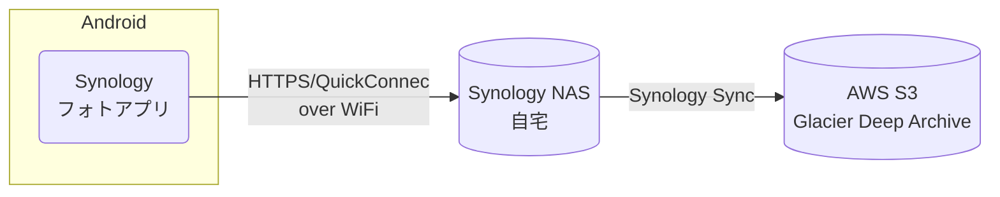
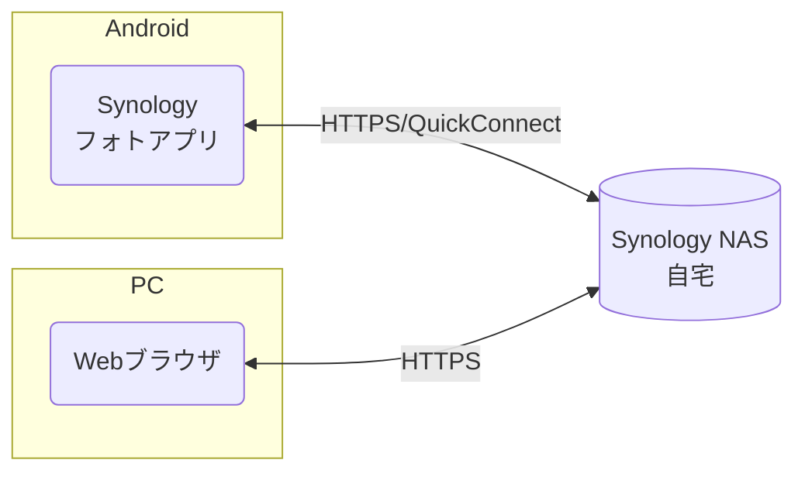

## TL;DR

写真・動画の保存先を Google フォトから自宅の NAS に変更し、
NAS 故障時に備えて AWS S3 にバックアップをとる仕組みを構築しました。

## 背景

Google フォトは多くのユーザーに愛されるサービスで、写真や動画を整理・共有する機能が充実しています。
一方で以下の制約があります。
- 写真・動画が増えると維持費がかかる。
- データが Google アカウントに紐づけられているため、
    アカウント停止時に写真・動画が失われるリスク。

### 有料ストレージ

2025年現在、Google フォトの無料ストレージは15GBです。
追加ストレージは有料で 2TB プランは年間14,500円です。

これは通常の写真保存には十分ですが、
動画だと300時間程度なので、
子どもの学芸会や運動会などを撮影するとあっという間に埋まります。

### アカウント停止のリスク

もうひとつリスクが高いのはポリシー違反によるアカウント停止です。
ポリシー違反の内容によってはアカウントが即時停止され、
これまでのデータへのアクセスも同時に遮断されるため、
データが完全に失われます。

ポリシー違反は自身には関係ないと思われるかもしれませんが、
Google フォトの [不正使用に関するプログラム ポリシーと違反措置](https://support.google.com/photos/answer/9292998?hl=ja) は内容が広範かつ随時更新されるため、
個人が継続的にポリシーを評価して対策を取るのは現実的には不可能で、
思わぬところでポリシー違反となる可能性があります。

多国籍企業が採用するポリシーは必ずしも日本における常識と合致しない場合もあり、
たとえば子どもを始めて沐浴させたときの写真が「児童の性的虐待と搾取」に関する著しいポリシー違反と判断され、
即時アカウントが停止されたケースも報告されています。

## システム

### 概要

動画・写真に関しては完全に自分のコントロール下に置きたかったので、
自宅に NAS (Network Attached Storage) を用意し、
そこにデータを保存することにしました。

Android スマートフォンで撮影した動画・写真は自動的に自宅の NAS に保存され、
保存された動画・写真は Android アプリや Web ブラウザで見ることができます。

自宅でデータを保存する際に怖いのは、
機器が故障することでデータが失われることです。
そこで最も故障しやすいパーツである HDD を RAID 1 構成で二重化し、
また AWS S3 にバックアップを取ることで NAS 本体の故障にも備えています。

**保存環境**

**閲覧環境**

### 詳細

#### NAS (Network Attached Storage)

システムの中核となるのは Synology 社が販売する NAS (Network Attached Storage) です。
これは単なるネットワークアクセス可能なストレージというだけではなく、
Synology 社が出しているスマートフォンアプリと連携したり、
外部サービスへのバックアップ機能などが充実しています。

私はエントリーモデルとなる [DS223j](https://www.synology.com/ja-jp/products/DS223j) を使用しています。
NAS 故障原因で最も一般的なものは HDD のトラブルですが、
DS223j は HDD ベイが2基あり、
RAID 1 構成で使用すると HDD が 1 台故障しても引き続き使うことができます。

また標準で DDNS と TLS 証明証の申請・インストールに対応しているため、
Synology 社が公開している文書に沿って作業するだけで、
外からでも自宅に設置した NAS にアクセスできるようになります。

[Synology ナレッジセンター: DDNS](https://kb.synology.com/ja-jp/DSM/help/DSM/AdminCenter/connection_ddns?version=7)

NAS 自体の設定と合わせて、
自宅のルーターで port forwarding の設定も必要になります。

| proto | port | 用途 |
| :-: | :-: | - |
| TCP | 443 | HTTPS |
| TCP | 5001 | DSM (Photo, Drive など) |

なお通信速度的には少し不利になりますが、
NAS と Synology 社のサーバーの間でトンネルを張る [QuickConnect](https://kb.synology.com/ja-jp/DSM/help/DSM/AdminCenter/connection_quickconnect?version=7) という仕組みも使えます。
こちらの方は設定がほぼ不要で、
自宅のルーターに port forwarding 規則を設定する必要もありません。

NAS は電子機器ということで停電や落雷などに弱いため、
無停電電源装置 (UPS) を購入して使っています。

#### Synology Photos

[Synology Photos](https://www.synology.com/ja-jp/DSM70/SynologyPhotos) は写真管理用サービスで、
写真データの保存・提供サービス自体は NAS で動き、
それにブラウザやスマートフォンアプリでアクセスすることができます。

AI による顔認識機能も備わっており、
Google フォトほどの精度ではないですが、
写っている人を認識して検索することも可能です。
ただし写っている「モノ」での検索は DS223j では対応していません。
これは上位機種の [DS224+](https://www.synology.com/ja-jp/products/DS224+) にメモリを増設することで可能になります [^photo-object]。

[^photo-object]: Synology ナレッジセンター: [Synology Photosで顔と物体の認識機能をサポートしているSynology NASモデルはどれですか](https://kb.synology.com/ja-jp/DSM/tutorial/Which_Synology_NAS_models_support_the_facial_recognition_feature_on_Synology_Photos)

スマートフォンアプリには、
撮影した動画・写真をバックグラウンドで NAS に転送する機能があるため、
一度インストールして設定してしまえば NAS への転送を意識することはありません。

## 運用

### 既存の写真・動画データの移行

私が Google フォトにある写真・動画データを NAS に移行した方法です。

1. [Google データエクスポート](https://takeout.google.com/settings/takeout) で Google フォトのデータを一括ダウンロード。
1. zip ファイルを展開すると動画・写真データが含まれていますが、Google フォト上で編集した場合には「編集前」「編集後」両方のファイルがあります。簡単なスクリプトを書いて片方を削除。
1. NAS のホームディレクトリを共有。home/Photos というディレクトリがあったので、その下に FromGoogle というディレクトリを作成し、動画・写真データをコピー。

NAS のホームディレクトリ共有機能を使わず、
Android の Google フォトアプリから対話的に行うことも可能です。

1. Anrdoid で Google フォトアプリを立ち上げる。
1. 写真をなるべく多く選択する。
1. 共有 -> Synology Photos を選択。

ただし選んだデータの数によっては共有処理が途中で終了してしまい、
やや動作が不安定でした。

### バックアップ

NAS に保存されたデータを、
さらに Amazon が提供するクラウドストレージサービスである AWS S3 にバックアップします。

AWS S3 では保存するデータ量×時間に比例する費用がかかりますが、
機能や保証されている性能が異なる複数のストレージクラスが提供されています。

一般的な「標準」ストレージクラスは低遅延で読み書きが行えますが、
大量のデータを保管するとコストが掛かります。

そこで今回のような「万が一」の事態に備えるためのバックアップには「Glacier Deep Archive」ストレージクラスを使います。
これは保管コストは S3 ストレージクラスの中で最も安いのですが、
代わりにデータの登録・取出時に多少の費用がかかり、
また登録したデータを取り出すには時間がかかります。
データの取り出しを依頼してから実際にダウンロード可能になるまで、
最大で12時間かかります。

参考：[Amazon S3 ストレージクラス](https://aws.amazon.com/jp/s3/storage-classes/)

たとえば 1TB のデータを最も安いデータセンターである us-west-2 に保管した場合、
データ保管費用として標準ストレージクラスだと毎月約 24 USD（約3,500円）かかりますが、
Glacier Deep Archive クラスだと 1/10 以下の約 1.1 USD（165円）で済みます。

なお Glacier Deep Archive ではファイルの最小ストレージ期間が決まっており、
短期間でファイルを消した場合でも180日分の費用が課されます。

#### 設定

Synology Photo アプリから　NAS に転送された写真・動画データは、
NAS 上で実行される [Synology Cloud Sync](https://www.synology.com/ja-jp/dsm/feature/cloud_sync) サービスを使って AWS S3 に同期します。

私はスマートフォンで写真を撮影した後、
その場で不要と判断した写真は即座に、
後で確認して重複していたりボヤケていたりするものは数日以内に消しています。
このようなファイルを S3 Glacier Deep Archive ストレージクラスで保存すると180日分の費用がかかってしまうため、
まずは NAS から AWS S3 には標準ストレージクラスで同期を行い、
S3 のライフサイクルルールを設定して、
数日間削除されずに残ったファイルのストレージクラスを「標準」から「Glacier Deep Archive」に変更しています。

参考: [Amazon S3 ライフサイクルを使用したオブジェクトの移行](https://docs.aws.amazon.com/ja_jp/AmazonS3/latest/userguide/lifecycle-transition-general-considerations.html)

## 損得勘定

移行によって良くなった点もあれば、
Google フォトでは可能だったが諦めざるを得なかったこともあります。

良くなった点
- 写真・動画は完全に自分の所有となり、サービス提供者側のポリシー変更などによりデータを失うリスクが減りました。
- 初期投資 (NAS と HDD 購入) がかかりますが、毎月のランニングコストは少なくなりました。

諦めた点
- Google フォトから Synology Photos への完全なデータ移行
    - Google フォトでは写真をグルーピングしたアルバムを多数作っていましたが、
        この移行は諦めました。
        手作業でいくつか Synology Photos 側に似たようなアルバムを作成しました。
    - Google フォトでは写真を共有した相手とチャット（コメント）のやり取りができますが、
        このデータは移行できません。
- Android アプリの使い勝手は Google フォトの方が上です。
- 顔認識の精度が劣ります。
- 人物・撮影場所・撮影日時での絞り込みはできますが、写っている物（e.g. 机）での検索ができません [^obj-search]。
- Google フォトでは Google アカウントを持っている人と簡単に写真を共有できますが、
    Sylonogy NAS だと面倒です。
    共有したい写真だけ一時的に Google フォトにアップロードして対応しています。
- バックアッププランの作成や、万が一 NAS が壊れた場合のリカバリは、すべて自分で行う必要があります。

[^obj-search]: 上位機種の NAS である DS224+ を使うと、写真に写っている物で検索することも可能です。
